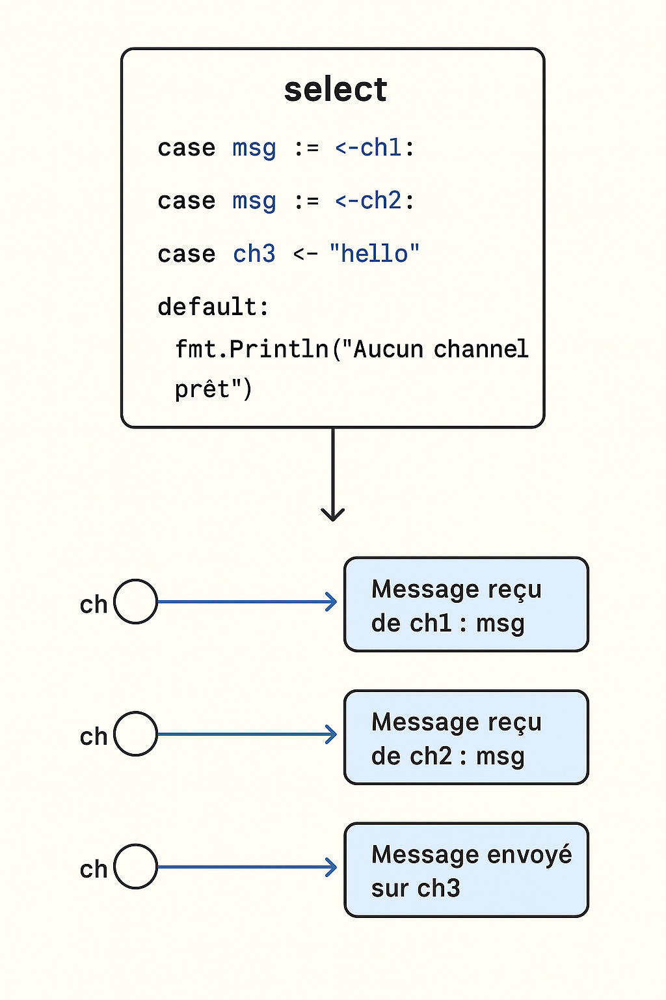

En Go, l’instruction `select` est utilisée pour **gérer la communication concurrente** via les **channels**.
Elle fonctionne un peu comme un `switch`, mais elle est conçue pour **attendre et écouter plusieurs opérations de channel** en même temps.

C'est un outil fondamental pour la **synchronisation des goroutines**.

---

## **1. Structure de base**

```go
select {
case msg := <-ch1:
    fmt.Println("Message reçu de ch1 :", msg)
case msg := <-ch2:
    fmt.Println("Message reçu de ch2 :", msg)
case ch3 <- "hello":
    fmt.Println("Message envoyé sur ch3")
default:
    fmt.Println("Aucun channel prêt")
}
```

### **Composants :**

* `case msg := <-ch1` : attend un message depuis le channel `ch1`.
* `case ch3 <- "hello"` : essaie d’envoyer `"hello"` dans `ch3`.
* `default` : optionnel, s’exécute si **aucun case n’est prêt** (permet d'éviter le blocage).

---

## **2. Fonctionnement**

* `select` **bloque l’exécution** jusqu’à ce qu’au **moins un des cases soit prêt**.
* S’il y a plusieurs cases prêtes **en même temps**, **Go choisit l’un d’eux au hasard** (équilibrage naturel).
* Le `default` rend le `select` **non bloquant**.

---

## **3. Exemple simple : réception concurrente**

Imaginons deux channels qui produisent des messages à des vitesses différentes.

```go
package main

import (
    "fmt"
    "time"
)

func main() {
    ch1 := make(chan string)
    ch2 := make(chan string)

    // Goroutine 1
    go func() {
        for {
            time.Sleep(500 * time.Millisecond)
            ch1 <- "ping"
        }
    }()

    // Goroutine 2
    go func() {
        for {
            time.Sleep(1 * time.Second)
            ch2 <- "pong"
        }
    }()

    // Lecture concurrente
    for {
        select {
        case msg := <-ch1:
            fmt.Println("ch1:", msg)
        case msg := <-ch2:
            fmt.Println("ch2:", msg)
        }
    }
}
```

### **Comportement :**

```
ch1: ping
ch1: ping
ch2: pong
ch1: ping
ch1: ping
ch2: pong
...
```

Ici :

* `ch1` envoie plus souvent (`ping` toutes les 500 ms),
* `ch2` envoie moins souvent (`pong` toutes les 1s),
* le `select` réagit dès qu’un message est prêt.

---

## **4. Avec un `default` (non bloquant)**

Si tu veux éviter que `select` bloque, tu peux ajouter un `default` :

```go
select {
case msg := <-ch1:
    fmt.Println("Message reçu:", msg)
default:
    fmt.Println("Rien de prêt, je continue...")
}
```

🔹 **Effet** :

* Si aucun channel n’est prêt, le `default` s’exécute **immédiatement**.
* C’est utile pour faire du **polling** ou éviter le blocage.

---

## **5. Avec un timeout**

Le `select` est parfait pour gérer des **timeouts** grâce au channel `time.After` :

```go
select {
case msg := <-ch1:
    fmt.Println("Message reçu:", msg)
case <-time.After(2 * time.Second):
    fmt.Println("Timeout après 2 secondes")
}
```

🔹 Ici :

* Si aucun message n’arrive dans `ch1` dans les 2 secondes, le `case <-time.After(...)` se déclenche.

---

## **6. Cas pratique : arrêt d'une goroutine**

Le `select` est souvent utilisé pour **écouter un signal d’arrêt** :

```go
func worker(stop chan bool) {
    for {
        select {
        case <-stop:
            fmt.Println("Arrêt du worker")
            return
        default:
            fmt.Println("Travail en cours...")
            time.Sleep(500 * time.Millisecond)
        }
    }
}

func main() {
    stop := make(chan bool)

    go worker(stop)

    time.Sleep(2 * time.Second)
    stop <- true // Demande l'arrêt
    time.Sleep(1 * time.Second)
}
```

### **Sortie :**

```
Travail en cours...
Travail en cours...
Travail en cours...
Travail en cours...
Arrêt du worker
```

---

## **Résumé**

| Cas d’usage                 | Comment faire                              |
| --------------------------- | ------------------------------------------ |
| Attendre plusieurs channels | `select { case <-ch1 ... case <-ch2 ... }` |
| Timeout                     | `case <-time.After(d)`                     |
| Non bloquant                | `default`                                  |
| Arrêt d’une goroutine       | `case <-stop`                              |

---


